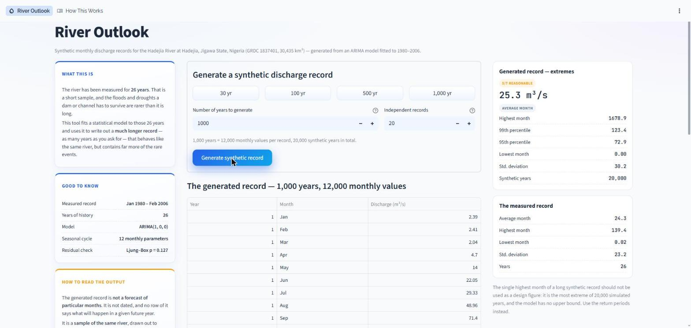
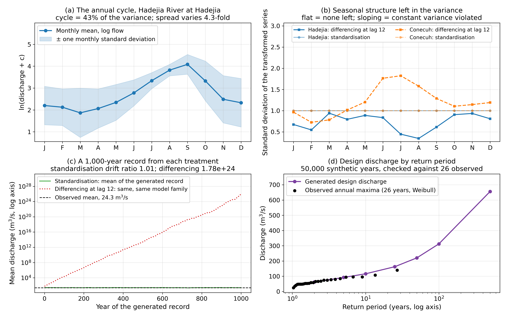
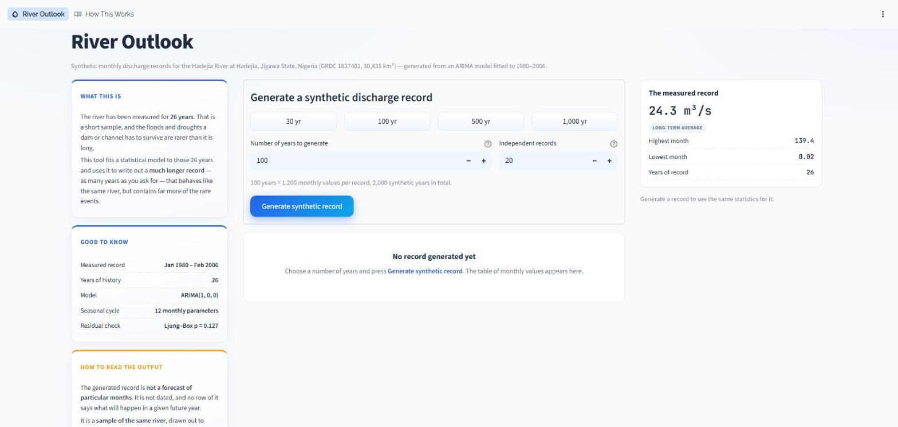
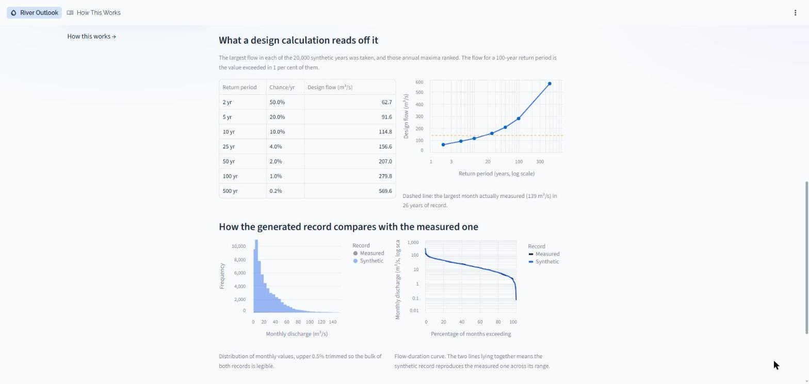
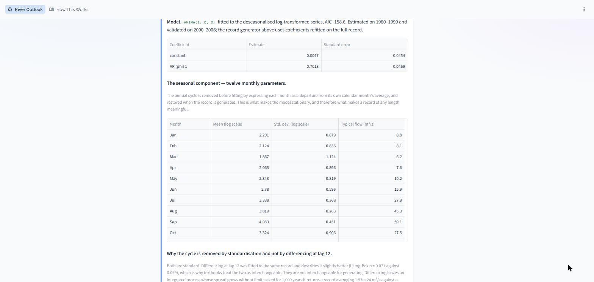
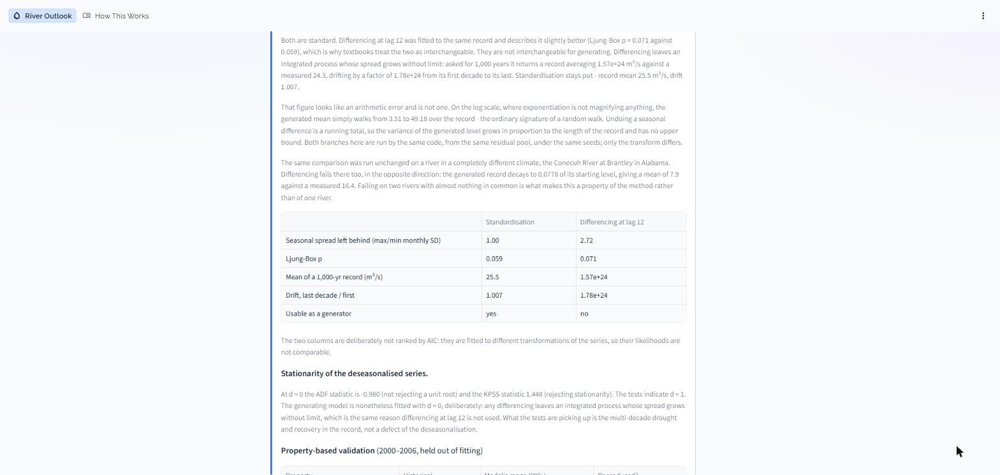
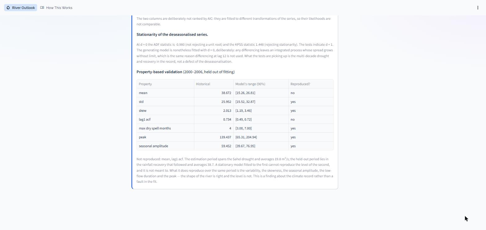
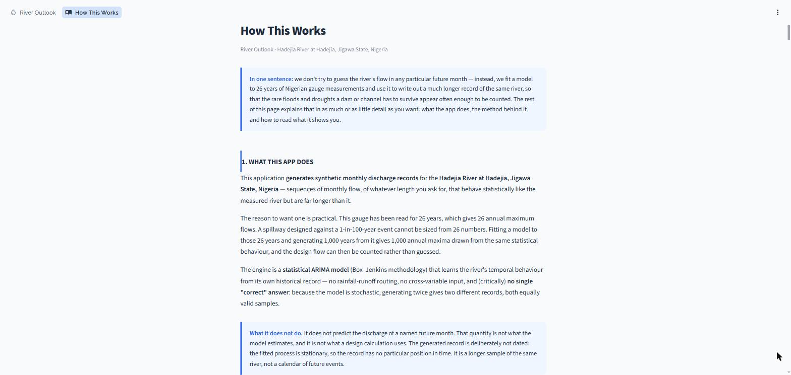

# Hydrology Forecaster: Synthetic River Records with ARIMA

A stochastic-hydrology engine and web app that fits a Box–Jenkins ARIMA model to a
monthly river-discharge record and uses it to **generate synthetic records of any
length**. From those records it reads the **design flows** (2- to 500-year return
periods) needed to size reservoirs, spillways and channels.

The case study is the **Hadejia River at Hadejia, Jigawa State, Nigeria** (GRDC
1837401, 30,435 km², Sahelian climate, 1980–2006). The **Conecuh River at Brantley,
Alabama** (USGS 02371500, humid subtropical) serves as a contrasting control basin.



## Why synthetic records, not forecasts

A 26-year gauge record gives you 26 annual maxima, which is not enough to size
anything against a 1-in-100-year flood. The model learns the river's statistical
behaviour and writes out a longer *sample* of the same river, for example
1,000 years × 20 independent traces. The design flow is then counted from that sample
instead of extrapolated.

Because of this, the app **does not predict the flow of a named future month**. The
generated years are numbered 1…N rather than dated: the process is stationary, so the
record has no position in time.

## Highlights

- **Everything is built from scratch** on NumPy, SciPy and pandas: ARIMA/SARIMA estimation by
  conditional sum of squares, ADF, KPSS, ACF/PACF, Ljung–Box, ARCH and Jarque–Bera
  tests, asymptotic standard errors, and AIC order selection with a stationarity margin.
  It does not use `statsmodels`.
- **Vectorised simulation.** 1,000 years × 50 traces takes about 0.4 s.
- **Bootstrapped innovations.** Normality is rejected for the residuals, and the tails
  matter for design, so innovations are resampled from the residuals instead of drawn
  from a Gaussian.
- **Property-based validation.** Instead of scoring one realisation against history, a
  1,000-member ensemble is checked for whether it reproduces 7 hydrological properties
  (mean, std, skew, lag-1 ACF, seasonal amplitude, longest dry spell, peak).
- **Log transform with an offset** for a river whose dry-season monthly flows reach
  zero, plus a sensitivity analysis of how much that offset choice costs.

## Key finding: standardisation vs. seasonal differencing

The annual cycle in a monthly river record has to be removed before an ARIMA model can be
fitted. Textbooks give two classical ways to do this and treat them as interchangeable:

| | Seasonal **standardisation** | **Differencing** at lag 12 |
|---|---|---|
| Hadejia: Ljung–Box p | 0.059 | **0.071** |
| Hadejia: leftover monthly-SD ratio | **1.00** | 2.72 |
| Hadejia: mean of 1,000-yr record (observed 24.3 m³/s) | **25.5** | 1.57 × 10²⁴ |
| Conecuh: mean of 1,000-yr record (observed 16.4 m³/s) | **16.9** | 7.9 |
| Drift, last decade / first (Hadejia · Conecuh) | **1.007 · 0.961** | 1.78 × 10²⁴ · 0.078 |

On both rivers, differencing scores better on the usual goodness-of-fit check, yet it
**cannot be used as a generator**. Undoing a seasonal difference is a running total, so
the generated level becomes a random walk. On the Hadejia it explodes, on the Conecuh it
decays. The direction is arbitrary; the failure is not. Differencing also leaves the
cycle in the *variance*: the most variable month is still 2.7× the least variable.
Standardisation keeps the generator stationary, which is why the engine uses it.



## Results (Hadejia)

| Item | Value |
|---|---|
| Model | ARIMA(1, 0, 0) on the standardised log series, φ₁ = 0.70 ± 0.05 |
| Residual checks | Ljung–Box p = 0.13, ARCH p = 0.17 |
| Property validation | 5 of 7 within the ensemble's 90 % envelope |
| Design flows (m³/s) | 2 yr 63 · 10 yr 116 · 50 yr 221 · 100 yr 312 · 500 yr 656 |

The two properties the model misses (mean and lag-1 ACF) have an identifiable cause. The
fitting period spans the Sahel drought (mean 19.8 m³/s) and the held-out period covers
the recovery after it (mean 38.7 m³/s).

## Screenshots

| | |
|---|---|
|  |  |
|  |  |
|  |  |

## Project layout

```
app.py, pages/        Streamlit app: "River Outlook" generator + "How This Works" docs
src/preprocess.py     loaders, log transform with offset, seasonal profile, basin registry
src/model.py          ARIMA(p,d,q)(P,D,Q)[s] by CSS, differencing operators, statistical tests
src/calibrate.py      seasonality strength, stationarity tests, AIC order selection
src/simulate.py       vectorised synthetic-record generation
src/validation.py     property-based ensemble validation
src/forecast.py       residual diagnostics
src/plots.py          analysis figures
run_pipeline.py       end-to-end run on both basins -> data/results.json + figures/
data/                 cached monthly/daily series and the fitted results
figures/              analysis figures and app screenshots
```

## Running it

```bash
pip install -r requirements.txt
python run_pipeline.py     # refit both basins, both methods; writes data/results.json + figures (~6 min)
streamlit run app.py       # launch the web app
```

The app never re-estimates the model. It loads the coefficients from
`data/results.json`, so it starts in seconds.

## Data sources

- **Hadejia:** Nigerian national gauging network, archived by the Global Runoff Data
  Centre and republished in GSIM (Do et al., 2018; Gudmundsson et al., 2018), CC-BY.
- **Conecuh:** USGS NWIS gauge 02371500 and the CAMELS dataset (Newman et al., 2015;
  Addor et al., 2017).

## References

- Box, G. E. P., Jenkins, G. M. and Reinsel, G. C. (2008). *Time Series
  Analysis: Forecasting and Control* (4th ed.). Wiley.
- Salas, J. D., Delleur, J. W., Yevjevich, V. and Lane, W. L. (1980). *Applied Modeling
  of Hydrologic Time Series*. Water Resources Publications.
- Gneiting, T. and Raftery, A. E. (2007). Strictly proper scoring rules, prediction,
  and estimation. *JASA*, 102(477), 359–378.

## License

[MIT](LICENSE)
